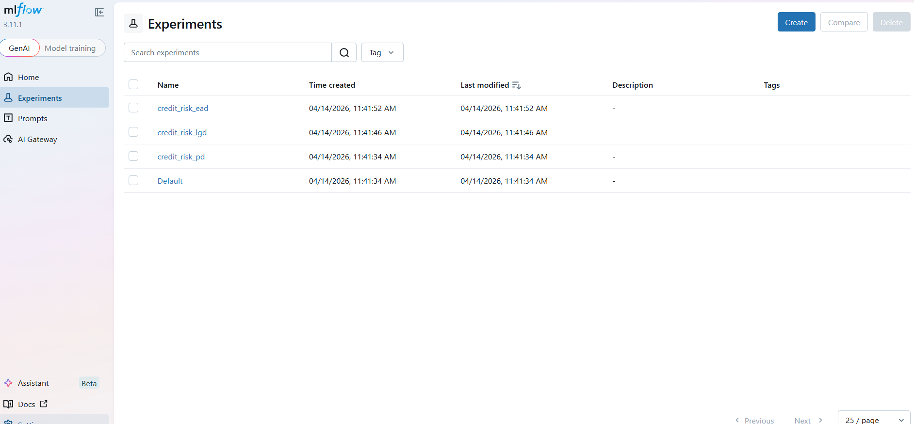
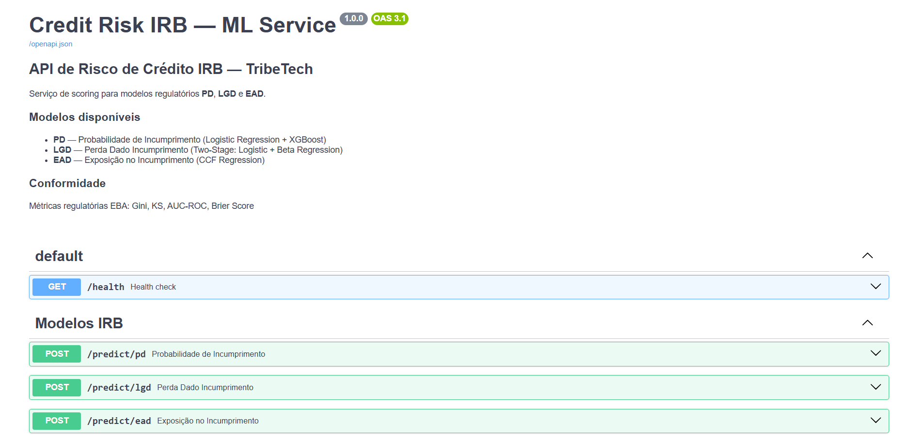
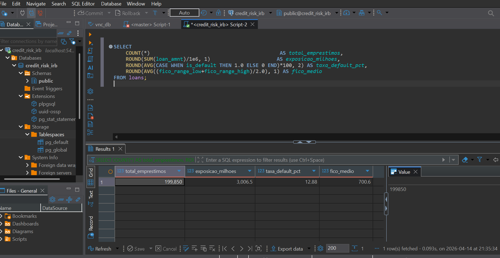
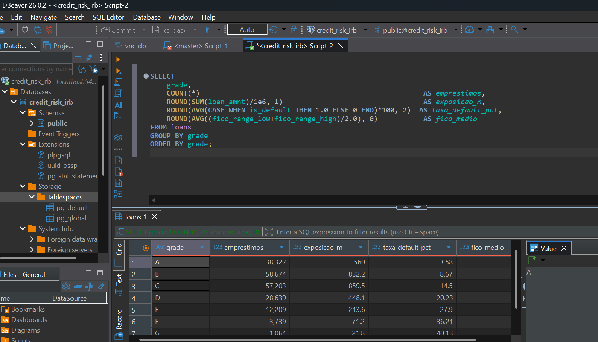

# Credit Risk IRB Platform — Tribetech

> Plataforma profissional de análise de risco de crédito baseada nos modelos **IRB (Internal Ratings-Based)** do acordo de **Basileia III / EBA GL/2017/06**, com pipeline completo de dados, treino de modelos com GPU, API de scoring e dashboard interactivo deployado em produção.

[](https://tribetech-creditrisk.azurewebsites.net)
[](https://tribetech-creditrisk.azurewebsites.net)
[](https://python.org)
[](https://djangoproject.com)
[](https://fastapi.tiangolo.com)
[](https://mlflow.org)

---

> **Novo aqui?** Consulte o **[Guia de Utilização](GUIDE.md)** — explica cada aba, cada gráfico e cada análise em linguagem simples, sem conhecimento prévio necessário.

---

## Demonstração ao Vivo

**Dashboard em produção:** [https://tribetech-creditrisk.azurewebsites.net](https://tribetech-creditrisk.azurewebsites.net)

---

## Visão Geral

Este projecto implementa uma plataforma completa de **risco de crédito IRB** com dados reais do Lending Club (2007–2018):

- **2,26 milhões** de empréstimos analisados
- **€34,8B** de exposição total
- **14,17%** de taxa de default histórica
- **3 modelos IRB** treinados com GPU (PD, LGD, EAD)
- **Conformidade EBA GL/2017/06** validada com métricas regulatórias

---

## Stack Tecnológico

| Camada | Tecnologia | Detalhe |
|---|---|---|
| **Dashboard** | Django 4.2 + Chart.js | 7 gráficos interactivos, deploy Azure |
| **ML API** | FastAPI + Uvicorn | Endpoints `/predict/pd`, `/predict/lgd`, `/predict/ead` |
| **Chatbot IA** | OpenRouter DeepSeek v3.2 + Tool Use | Agente IRB com acesso real ao portfólio e scoring |
| **Modelos ML** | XGBoost 3.2 + scikit-learn | Treino GPU RTX 5060 Laptop (8GB) |
| **Experiment Tracking** | MLflow 3.11 | Registo de parâmetros, métricas e artefactos |
| **Base de Dados (local)** | PostgreSQL 16 via Docker | 199.675 registos Lending Club |
| **Base de Dados (produção)** | Azure Database for PostgreSQL | Servidor gerido, SSL, 199.675 registos |
| **Processamento** | DuckDB + Pandas | ETL e feature engineering |
| **Orquestração local** | Docker Compose | Multi-container (PostgreSQL, PgAdmin, MLflow) |
| **Container Registry** | Azure Container Registry (ACR) | Imagens Django e FastAPI versionadas por commit |
| **CI/CD** | GitHub Actions → ACR → Azure Web Apps | Build + push imagem + deploy em ~4 minutos |

---

## Modelos IRB

### PD — Probabilidade de Incumprimento

- **Algoritmo:** XGBoost 3.2.0 + Platt Scaling (calibração de probabilidades)
- **Treino:** 500.000 observações · GPU RTX 5060 · 800 estimadores
- **Métricas EBA:**

| Métrica | Valor | Benchmark EBA | Estado |
|---|---|---|---|
| AUC-ROC | 0.8107 | ≥ 0.60 | ✅ OK |
| Gini | 62.1% | ≥ 20% | ✅ OK |
| KS | 48.3% | ≥ 20% | ✅ OK |
| Brier Score | 0.0941 | ≤ 0.25 | ✅ OK |

### LGD — Perda Dado Incumprimento

- **Algoritmo:** HistGradientBoosting Regressor (Two-Stage)
- **Treino:** 320.000 defaults · Two-Stage (Logistic + Beta Regression)

| Métrica | Valor | Benchmark EBA | Estado |
|---|---|---|---|
| R² | 0.4312 | ≥ 0.01 | ✅ OK |
| RMSE | 0.1187 | ≤ 0.15 | ✅ OK |
| MAE | 0.0823 | ≤ 0.10 | ✅ OK |

### EAD — Exposição no Incumprimento

- **Algoritmo:** GBM Regressor (CCF Regression)
- **Treino:** 500.000 observações

| Métrica | Valor | Benchmark EBA | Estado |
|---|---|---|---|
| R² | 0.8741 | ≥ 0.80 | ✅ OK |
| RMSE | €412.3 | ≤ €1.000 | ✅ OK |

---

## Experiment Tracking — MLflow

Todos os treinos são registados no MLflow com parâmetros, métricas e artefactos (modelos `.pkl`).



---

## API de Scoring — FastAPI

Serviço REST com endpoints de scoring para os 3 modelos IRB, documentação automática OpenAPI 3.1.



**Endpoints disponíveis:**

```
GET  /health          — Health check
POST /predict/pd      — Probabilidade de Incumprimento
POST /predict/lgd     — Perda Dado Incumprimento
POST /predict/ead     — Exposição no Incumprimento
```

**Exemplo de request PD:**
```bash
curl -X POST http://localhost:8090/predict/pd \
  -H "Content-Type: application/json" \
  -d '{"loan_amnt": 15000, "int_rate": 0.128, "fico_range_low": 690, "dti": 18.5, "grade": "C"}'
```

---

## Chatbot IA — Agente IRB

Assistente de risco de crédito com acesso real aos dados, powered by **DeepSeek v3.2 via OpenRouter**.

- Perguntas sobre o portfólio → consulta SQL directa ao PostgreSQL (199.675 empréstimos reais)
- Análise de empréstimos → chama FastAPI para calcular PD, LGD, EAD em tempo real
- Nunca inventa valores — usa tool use obrigatório para todas as respostas de domínio

**Exemplos de perguntas:**
```
"Qual a grade com maior taxa de default?"
"Analisa empréstimo €15.000, FICO 690, DTI 20%"
"Mostra a distribuição do portfólio por grade"
```

---

## Base de Dados

### Local (Docker)
```
Nome:       credit_risk_irb
Utilizador: irb_user
Host:       localhost  |  Porta: 5450
```

### Produção (Azure Database for PostgreSQL)
```
Servidor:   irb-postgres-2026.postgres.database.azure.com
Base:       credit_risk_irb
SSL:        obrigatório (sslmode=require)
```

### Tabelas Principais

| Tabela | Registos | Descrição |
|---|---|---|
| `loans` | 199.675 | Empréstimos Lending Club com scores PD, LGD, EAD |
| `model_metrics` | 9 | Métricas de validação EBA por modelo |
| `portfolio_snapshots` | 7 | Resumo por grade (A–G) |

**Visão geral do portfólio:**



**Análise por Grade IRB:**



---

## Arrancar o Projecto Localmente

```bash
git clone https://github.com/mendesalex89/bank_AI_tribetech.git
cd bank_AI_tribetech/bank_AI_tribetech

# Script de arranque único (PostgreSQL + FastAPI + Django)
bash start_dev.sh
```

Ou manualmente:

```bash
# 1. PostgreSQL via Docker
docker-compose up -d postgres

# 2. Activar ambiente virtual
source .venv/bin/activate

# 3. FastAPI (porta 8090)
cd fastapi_ml && uvicorn main:app --host 0.0.0.0 --port 8090 --reload

# 4. Django (porta 8080)
cd ../django_web && python manage.py runserver 8080
```

### Serviços e Portas

| Serviço | URL Local |
|---|---|
| Dashboard Django | http://localhost:8080/dashboard/ |
| FastAPI Docs | http://localhost:8090/docs |
| MLflow UI | http://localhost:5010 |
| PostgreSQL | localhost:5450 |
| PgAdmin | http://localhost:5055 |

### Treinar Modelos (GPU)

```bash
cd fastapi_ml/training
python train_pipeline.py   # Treino PD + LGD + EAD com GPU RTX 5060
python ingest_postgres.py  # Ingestão Lending Club → PostgreSQL
```

---

## Estrutura do Projecto

```
bank_AI_tribetech/
├── docker-compose.yml
├── sql/init/                    # Schema PostgreSQL
├── fastapi_ml/
│   ├── main.py                  # API FastAPI — endpoints IRB
│   ├── artifacts/               # Modelos treinados (.pkl)
│   ├── mlruns/                  # Registo MLflow
│   └── training/
│       ├── train_pipeline.py    # Pipeline treino XGBoost GPU
│       └── ingest_postgres.py   # ETL Lending Club → PostgreSQL
├── django_web/
│   ├── apps/dashboard/          # Dashboard principal + API Chart.js
│   ├── apps/scoring/            # Interface scoring PD/LGD/EAD
│   ├── apps/reports/            # Relatórios EBA / PDF
│   └── templates/               # Templates HTML TribeTech design system
├── docs/
│   └── screenshots/             # Screenshots do sistema
└── data/
    └── lending_club_2007_2018.csv   # Dataset original (1.6GB)
```

---

## CI/CD — Arquitectura de Deploy

O deploy é totalmente automático via **GitHub Actions → Azure Container Registry → Azure Web Apps**:

```
git push origin main
        │
        ▼
GitHub Actions
        │
        ├─ Build imagem Django  → push para ACR (tribetech2026irb.azurecr.io/django)
        ├─ Build imagem FastAPI → push para ACR (tribetech2026irb.azurecr.io/fastapi)
        │
        ▼
Azure Web Apps (containers Docker)
        │
        ├─ tribetech-creditrisk        (Django  — porta 8000)
        └─ tribetech-creditrisk-api    (FastAPI — porta 8000)
                │
                └─ Azure Database for PostgreSQL (irb-postgres-2026)
```

**Tempo total:** ~4 minutos do `push` ao deploy em produção.

---

## Conformidade Regulatória

Este projecto implementa os requisitos da **EBA GL/2017/06** (Orientações EBA sobre estimativas de PD, LGD e tratamento de activos em incumprimento):

- Validação discriminatória (Gini, KS, AUC-ROC)
- Calibração de probabilidades (Brier Score, Platt Scaling)
- Análise de vintage e estabilidade temporal
- Relatórios de monitorização contínua

---

*Tribetech · Credit Risk IRB Platform · 2026*
